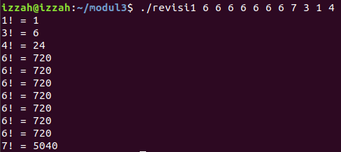
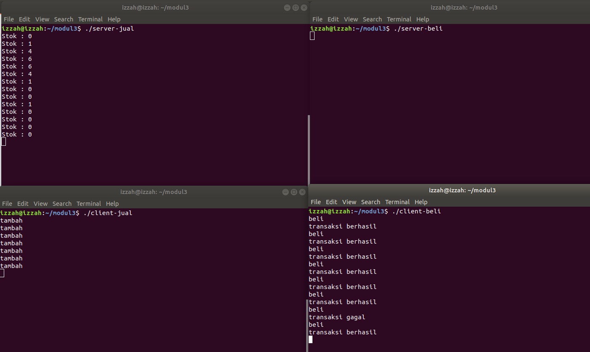

# SoalShift_modul3_C03

#### 05111740000044 - Izzah Dinillah
#### 05111740000070 - Raja Permata Boy Mangatur Simarmata

## Soal 1

Buatlah program C yang bisa menghitung faktorial secara parallel lalu menampilkan hasilnya secara berurutan


Contoh:
 
./faktorial 5 3 4

3! = 6

4! = 24

5! = 120

### Jawaban :
```
#include <stdio.h>
#include <stdlib.h>
#include <pthread.h>

int numbers[100];
int k;

void* print_factorial(void* arg)
{
    	int answer = numbers[k];
    	int iter;

    	for(iter = 1; iter < numbers[k]; iter++)
    	{
 	   	answer = answer * iter;
    	}

    	printf("%d! = %d\n", numbers[k], answer);
}

int main(int argc, char* argv[])
{
    	int i, j, temp;
    	pthread_t thread[argc - 1];

    	for (i = 0; i < argc - 1; i++)
    	{
 	   	numbers[i] = atoi(argv[i + 1]);
    	}

    	for (i = 0; i < argc - 1; i++)
    	{
 	   	for (j = i + 1; j < argc - 1; j++)
 	   	{
 		   	if (numbers[i] > numbers[j])
 		   	{
 			   	temp = numbers[i];
 			  	numbers[i] = numbers[j];
 			   	numbers[j] = temp;
 		   	}
 	   	}
    	}

    	for (k = 0; k < argc - 1; k++)
    	{
 	   	pthread_create(&(thread[k]), NULL, print_factorial, &numbers[k]);
 	   	pthread_join(thread[k], NULL);
    	}

    	exit(0);
    	return EXIT_SUCCESS;
}
```
* Membaca input yang dimasukkan dengan `int argc, char* argv[]` dan menyimpannya dalam array numbers
* Lalu sorting isi array numbers agar terurut dari terkecil ke terbesar
* Kemudian untuk tiap isi dari array numbers, dibuat thread yang memanggil fungsi `print_factorial`
* Fungsi `print_factorial` digunakan untuk menghitung faktorial serta mencetak hasil dari perhitungan faktorial tersebut




## Soal 2

Pada suatu hari ada orang yang ingin berjualan 1 jenis barang secara private, dia memintamu membuat program C dengan spesifikasi sebagai berikut:

a. Terdapat 2 server: server penjual dan server pembeli

b. 1 server hanya bisa terkoneksi dengan 1 client

c. Server penjual dan server pembeli memiliki stok barang yang selalu sama

d. Client yang terkoneksi ke server penjual hanya bisa menambah stok
   - Cara menambah stok: client yang terkoneksi ke server penjual mengirim string “tambah” ke server lalu stok bertambah 1

e. Client yang terkoneksi ke server pembeli hanya bisa mengurangi stok
   - Cara mengurangi stok: client yang terkoneksi ke server pembeli mengirim string “beli” ke server lalu stok berkurang 1

f. Server pembeli akan mengirimkan info ke client yang terhubung dengannya apakah transaksi berhasil atau tidak berdasarkan ketersediaan stok
   - Jika stok habis maka client yang terkoneksi ke server pembeli akan mencetak “transaksi gagal”
   - Jika stok masih ada maka client yang terkoneksi ke server pembeli akan mencetak “transaksi berhasil”

g. Server penjual akan mencetak stok saat ini setiap 5 detik sekali

h. Menggunakan thread, socket, shared memory


### Jawaban :
Server Penjual :
```
#include <stdio.h>
#include <sys/socket.h>
#include <stdlib.h>
#include <netinet/in.h>
#include <string.h>
#include <unistd.h>
#include <sys/wait.h>
#include <sys/ipc.h>
#include <sys/shm.h>
#include<pthread.h>
#include<sys/types.h>
#define PORT 8081

int *stok;
pthread_t tid[3];

void* print_stok(void *arg)
{
  	pthread_t id=pthread_self();
  	if(pthread_equal(id,tid[0]))
  	{
    		while(1)
    		{
      			sleep(5);
      			printf("Stok : %d\n", *stok);
    		}
  	}
  	return NULL;
}

int main(int argc, char const *argv[]) {
    	int server_fd, new_socket, valread;
    	struct sockaddr_in address;
    	int opt = 1;
    	int addrlen = sizeof(address);
    	char buffer[1024] = {0};

    	key_t key = 1234;
    	int *value;

    	int shmid = shmget(key, sizeof(int), IPC_CREAT | 0666);
    	value = shmat(shmid, NULL, 0);

    	*value=0;
    	stok=value;

    	if ((server_fd = socket(AF_INET, SOCK_STREAM, 0)) == 0) {
        	perror("socket failed");
        	exit(EXIT_FAILURE);
    	}

    	if (setsockopt(server_fd, SOL_SOCKET, SO_REUSEADDR | SO_REUSEPORT, &opt, sizeof(opt))) {
        	perror("setsockopt");
        	exit(EXIT_FAILURE);
    	}

    	address.sin_family = AF_INET;
    	address.sin_addr.s_addr = INADDR_ANY;
    	address.sin_port = htons( PORT );

    	if (bind(server_fd, (struct sockaddr *)&address, sizeof(address))<0) {
        	perror("bind failed");
        	exit(EXIT_FAILURE);
    	}

    	if (listen(server_fd, 3) < 0) {
        	perror("listen");
        	exit(EXIT_FAILURE);
    	}

    	if ((new_socket = accept(server_fd, (struct sockaddr *)&address, (socklen_t*)&addrlen))<0) {
        	perror("accept");
        	exit(EXIT_FAILURE);
    	}
    	
	pthread_create(&(tid[0]), NULL, &print_stok, NULL);

    	while(strcmp(buffer, "tutup"))
    	{
        	memset(buffer, 0, sizeof(buffer));
        	valread = read( new_socket , buffer, 1024);

  		if(!strcmp(buffer, "tambah"))
  		{
      			*value+=1;
      			stok = value;
  		}
    	}
    	exit(0);
    	return 0;
}
```
Client Penjual :
```
#include <stdio.h>
#include <sys/socket.h>
#include <stdlib.h>
#include <netinet/in.h>
#include <string.h>
#include <unistd.h>
#include <arpa/inet.h>
#include <sys/ipc.h>
#include <sys/shm.h>
#define PORT 8081

int main(int argc, char const *argv[]) {
    	struct sockaddr_in address;
    	int sock = 0, valread;
    	struct sockaddr_in serv_addr;
    	char msg[1024];
    	char buffer[1024] = {0};
    	
	if ((sock = socket(AF_INET, SOCK_STREAM, 0)) < 0) {
        	printf("\n Socket creation error \n");
        	return -1;
    	}

    	memset(&serv_addr, '0', sizeof(serv_addr));

    	serv_addr.sin_family = AF_INET;
    	serv_addr.sin_port = htons(PORT);

    	if(inet_pton(AF_INET, "127.0.0.1", &serv_addr.sin_addr)<=0) {
        	printf("\nInvalid address/ Address not supported \n");
        	return -1;
    	}

    	if (connect(sock, (struct sockaddr *)&serv_addr, sizeof(serv_addr)) < 0) {
        	printf("\nConnection Failed \n");
        	return -1;
    	}

    	while(strcmp(msg, "tutup"))
    	{
  		memset(buffer, 0, sizeof(buffer));
        	memset(msg, 0, sizeof(msg));
  		scanf("%s", msg);
        	send(sock , msg , strlen(msg) , 0 );
    	}
    	return 0;
}
```
Server Pembeli :
```
#include <stdio.h>
#include <sys/socket.h>
#include <stdlib.h>
#include <netinet/in.h>
#include <string.h>
#include <unistd.h>
#include <sys/wait.h>
#include <sys/ipc.h>
#include <sys/shm.h>
#define PORT 8080

int main(int argc, char const *argv[]) {
    	int server_fd, new_socket, valread;
    	struct sockaddr_in address;
    	int opt = 1;
    	int addrlen = sizeof(address);
    	char buffer[1024] = {0};
    	char *msg1 = "transaksi berhasil";
    	char *msg2 = "transaksi gagal";

    	key_t key = 1234;
    	int *value;

    	int shmid = shmget(key, sizeof(int), IPC_CREAT | 0666);
    	value = shmat(shmid, NULL, 0);

    	*value=0;

    	if ((server_fd = socket(AF_INET, SOCK_STREAM, 0)) == 0) {
        	perror("socket failed");
        	exit(EXIT_FAILURE);
    	}

    	if (setsockopt(server_fd, SOL_SOCKET, SO_REUSEADDR | SO_REUSEPORT, &opt, sizeof(opt))) {
        	perror("setsockopt");
        	exit(EXIT_FAILURE);
    	}

    	address.sin_family = AF_INET;
    	address.sin_addr.s_addr = INADDR_ANY;
    	address.sin_port = htons( PORT );

    	if (bind(server_fd, (struct sockaddr *)&address, sizeof(address))<0) {
        	perror("bind failed");
        	exit(EXIT_FAILURE);
    	}

    	if (listen(server_fd, 3) < 0) {
        	perror("listen");
        	exit(EXIT_FAILURE);
    	}

    	if ((new_socket = accept(server_fd, (struct sockaddr *)&address, (socklen_t*)&addrlen))<0) {
        	perror("accept");
        	exit(EXIT_FAILURE);
    	}

    	while(strcmp(buffer, "tutup"))
    	{
        	memset(buffer, 0, sizeof(buffer));
        	valread = read( new_socket , buffer, 1024);

  		if(!strcmp(buffer, "beli"))
  		{
      			if(*value>0)
      			{
    				*value-=1;
    				send(new_socket , msg1 , strlen(msg1) , 0 );
      			}
      			else
      			{
    				send(new_socket , msg2 , strlen(msg2) , 0 );
      			}
  		}
    	}
    	return 0;
}
```
Client Pembeli :
```
#include <stdio.h>
#include <sys/socket.h>
#include <stdlib.h>
#include <netinet/in.h>
#include <string.h>
#include <unistd.h>
#include <arpa/inet.h>
#include <sys/ipc.h>
#include <sys/shm.h>
#define PORT 8080

int main(int argc, char const *argv[]) {
    	struct sockaddr_in address;
    	int sock = 0, valread;
    	struct sockaddr_in serv_addr;
   	char msg[1024];
    	char buffer[1024] = {0};
    	
	if ((sock = socket(AF_INET, SOCK_STREAM, 0)) < 0) {
        	printf("\n Socket creation error \n");
        	return -1;
    	}

    	memset(&serv_addr, '0', sizeof(serv_addr));

    	serv_addr.sin_family = AF_INET;
    	serv_addr.sin_port = htons(PORT);

    	if(inet_pton(AF_INET, "127.0.0.1", &serv_addr.sin_addr)<=0) {
        	printf("\nInvalid address/ Address not supported \n");
        	return -1;
    	}

    	if (connect(sock, (struct sockaddr *)&serv_addr, sizeof(serv_addr)) < 0) {
        	printf("\nConnection Failed \n");
        	return -1;
    	}

    	while(strcmp(msg, "tutup"))
    	{
        	memset(buffer, 0, sizeof(buffer));
        	memset(msg, 0, sizeof(msg));
  		scanf("%s", msg);
        	send(sock , msg , strlen(msg) , 0 );

        	if(strcmp(msg, "tutup"))
  		{
          		valread = read( sock , buffer, 1024);
    			printf("%s\n",buffer );
  		}
    	}
    	return 0;
}
```
* Terdapat 2 server dan 2 client, yaitu server-jual, server-beli, client-jual, dan client-beli
* Menggunakan shared memory yang menyimpan jumlah stok. Shared memory tersebut diakses oleh server-jual dan server-beli
* Thread digunakan pada server-jual untuk mencetak jumlah stok saat ini setiap 5 detiknya
* Client-jual berguna menambah stok dengan mengirimkan string `tambah`, jumlah stok pun akan bertambah 1
* Client-beli berguna mengurangi stok dengan mengirim string `beli`, jumlah stok akan berkurang 1. Juga menampilkan status transaksi yang dikirim oleh server-beli
* Server-jual berguna menghitung penambahan jumlah stok sesuai instruksi dari client-jual. Jika client-jual mengirimkan string `tambah` maka stok akan ditambahkan
* Server-beli berguna menghitung pengurangan jumlah stok serta menentukan status transaksi pembelian yang dilakukan. Jika stok sebelumnya tersedia (tidak 0) maka server-beli mengurangi stok yang ada dan mengirimkan string `transaksi berhasil` yang akan dibaca oleh client-jual dan menampilkannya pada terminal. Jika stok 0, maka server-beli akan mengirimkan string `transaksi gagal`


## Soal 3

Agmal dan Iraj merupakan 2 sahabat yang sedang kuliah dan hidup satu kostan, sayangnya mereka mempunyai gaya hidup yang berkebalikan, dimana Iraj merupakan laki-laki yang sangat sehat,rajin berolahraga dan bangun tidak pernah kesiangan sedangkan Agmal hampir menghabiskan setengah umur hidupnya hanya untuk tidur dan ‘ngoding’. Dikarenakan mereka sahabat yang baik, Agmal dan iraj sama-sama ingin membuat satu sama lain mengikuti gaya hidup mereka dengan cara membuat Iraj sering tidur seperti Agmal, atau membuat Agmal selalu bangun pagi seperti Iraj. Buatlah suatu program C untuk menggambarkan kehidupan mereka dengan spesifikasi sebagai berikut:

a. Terdapat 2 karakter Agmal dan Iraj

b. Kedua karakter memiliki status yang unik
   - Agmal mempunyai WakeUp_Status, di awal program memiliki status 0
   - Iraj memiliki Spirit_Status, di awal program memiliki status 100
   - Terdapat 3 Fitur utama
     - All Status, yaitu menampilkan status kedua sahabat.
       
       Ex: 
       - Agmal WakeUp_Status = 75 
       - Iraj Spirit_Status = 30
     - “Agmal Ayo Bangun” menambah WakeUp_Status Agmal sebesar 15 point
     - “Iraj Ayo Tidur” mengurangi Spirit_Status Iraj sebanyak 20 point
   - Terdapat Kasus yang unik dimana:
     - Jika Fitur “Agmal Ayo Bangun” dijalankan sebanyak 3 kali, maka Fitur “Iraj Ayo Tidur” Tidak bisa dijalankan selama 10 detik (Dengan mengirim pesan ke sistem “Fitur Iraj Ayo Tidur disabled 10 s”)
     - Jika Fitur  “Iraj Ayo Tidur” dijalankan sebanyak 3 kali, maka Fitur “Agmal Ayo Bangun” Tidak bisa dijalankan selama 10 detik (Dengan mengirim pesan ke sistem “Agmal Ayo Bangun disabled 10 s”)
   - Program akan berhenti jika Salah Satu :
     - WakeUp_Status Agmal >= 100 (Tampilkan Pesan “Agmal Terbangun,mereka bangun pagi dan berolahraga”)
     - Spirit_Status Iraj <= 0 (Tampilkan Pesan “Iraj ikut tidur, dan bangun kesiangan bersama Agmal”)
   - Syarat Menggunakan Lebih dari 1 Thread


### Jawaban :
```
#include<stdio.h>
#include<string.h>
#include<pthread.h>
#include<stdlib.h>
#include<unistd.h>

pthread_t tid1, tid2, tid3;
int wakeup_status=0;
int spirit_status=100;
int flag=0;
int counteragmal = 0;
int counteriraj = 0;
int tidur1=0, tidur2=0;

void* agmal(void *arg)
{
   while(1){
    if(wakeup_status >= 100){
        printf("Agmal Terbangun, mereka bangun pagi dan berolahraga\n");
        exit(0);
        }

    else if(flag == 1){
    flag=0;
    if(counteriraj ==3){
    counteriraj=0;
    tidur1=1;
    flag=0;
    sleep(10);
    tidur1=0;
    continue;
    }

    else{
    printf("Agmal\n");
    wakeup_status+=15;
    counteragmal+=1;
    if(counteragmal == 3){
    flag = 2;
    printf("Iraj Disabled\n");
          }
       }
     }

    }
}

void* iraj(void *arg)
{
   while(1){
   if(spirit_status <= 0){
        printf("Iraj ikut tidur, dan bangun kesiangan bersama Agmal\n");
        exit(0);
      }

   else if(flag==2){
    flag=0;
    if(counteragmal == 3){
    counteragmal=0;
    tidur2=1;
    flag=0;
    sleep(10);
    tidur2=0;
    continue;
    }

   else {
   printf("Iraj\n");
   spirit_status-=20;
   counteriraj+=1;
      if(counteriraj == 3){
     flag = 1;
      printf("Agmal Disabled\n");
                          }
         }
       }
     }
   }


void* ustatus(void *arg)
{
    while(1){
    if(flag==3){
    flag=0;
    printf("Agmal memiliki WakeUp_Status = %d\n", wakeup_status);
    printf("Iran memiliki Spirit_Status = %d\n", spirit_status);


       }
    }
}


int main(void)
{

    pthread_create(&(tid1), NULL, agmal, NULL);
    pthread_create(&(tid2), NULL, iraj, NULL);
    pthread_create(&(tid3), NULL, ustatus, NULL);
    printf("1. Agmal Ayo Bangun\n");
    printf("2. Iraj Ayo Tidur\n");
    printf("3. View Status\n");
    while(1){
    while(flag!=0) {}
    int inp;
    scanf("%d", &inp);
    if(inp == 1 || inp == 2 || inp == 3){
       if(tidur1==0)
          flag=inp;
       else if(tidur2==0)
          flag=inp;
     }

   }

    return 0;
}
```
Pertama, untuk Agmal, Iraj dan View Status, kita membuat 3 thread sebagai 3 fungsi utama. Agmal untuk mengecek Agmal ayo bangun, Iraj untuk mengecek Iraj ayo tidur, dan view status untuk mengecek ke 2 status tersebut. Kita akan menjalankan thread sesuai dengan inputan. Apabila, kita menjalan Agmal/Iraj sebanyak 3 kali, maka fungsi selain yang dijalankan (Agmal/Iraj) akan didisable selama 10 detik. Untuk mengetahui sudah dijalankan 3 kali atau tidak, kami menggunakan counter. counteragmal untuk mengecek berapa kali fungsi Agmal dijalankan, counteriraj untuk mengecek berapa kali fungsi Iraj dijalankan. Apabila, counter mencapai 3, maka akan membuat boolean tidur1 & tidur2. tidur1 utk agmal, tidur2 utk iraj. Boolean diubah menjadi true lalu thread yang sedang didisable tersebut tidak akan bs berjalan namun thread yg lain bs berjalan. 


## Soal 4

Buatlah sebuah program C dimana dapat menyimpan list proses yang sedang berjalan (ps -aux) maksimal 10 list proses. Dimana awalnya list proses disimpan dalam di 2 file ekstensi .txt yaitu  SimpanProses1.txt di direktori /home/Document/FolderProses1 dan SimpanProses2.txt di direktori /home/Document/FolderProses2 , setelah itu masing2 file di  kompres zip dengan format nama file KompresProses1.zip dan KompresProses2.zip dan file SimpanProses1.txt dan SimpanProses2.txt akan otomatis terhapus, setelah itu program akan menunggu selama 15 detik lalu program akan mengekstrak kembali file KompresProses1.zip dan KompresProses2.zip 

Dengan Syarat : 
- Setiap list proses yang di simpan dalam masing-masing file .txt harus berjalan bersama-sama
- Ketika mengkompres masing-masing file .txt harus berjalan bersama-sama
- Ketika Mengekstrak file .zip juga harus secara bersama-sama
- Ketika Telah Selesai melakukan kompress file .zip masing-masing file, maka program akan memberi pesan “Menunggu 15 detik untuk mengekstrak kembali”
- Wajib Menggunakan Multithreading
- Boleh menggunakan system


### Jawaban :
```

```
* 


## Soal 5

Angga, adik Jiwang akan berulang tahun yang ke sembilan pada tanggal 6 April besok. Karena lupa menabung, Jiwang tidak mempunyai uang sepeserpun untuk membelikan Angga kado. Kamu sebagai sahabat Jiwang ingin membantu Jiwang membahagiakan adiknya sehingga kamu menawarkan bantuan membuatkan permainan komputer sederhana menggunakan program C. Jiwang sangat menyukai idemu tersebut. Berikut permainan yang Jiwang minta. 

a. Pemain memelihara seekor monster lucu dalam permainan. Pemain dapat  memberi nama pada monsternya.

b. Monster pemain memiliki hunger status yang berawal dengan nilai 200 (maksimalnya) dan nanti akan berkurang 5 tiap 10 detik.Ketika hunger status mencapai angka nol, pemain akan kalah. Hunger status dapat bertambah 15 apabila pemain memberi makan kepada monster, tetapi banyak makanan terbatas dan harus beli di Market.

c. Monster pemain memiliki hygiene status yang berawal dari 100 dan nanti berkurang 10 tiap 30 detik. Ketika hygiene status mencapai angka nol, pemain akan kalah. Hygiene status' dapat bertambah 30 hanya dengan memandikan monster. Pemain dapat memandikannya setiap 20 detik(cooldownnya 20 detik).

d. Monster pemain memiliki health status yang berawal dengan nilai 300. Variabel ini bertambah (regenerasi)daa 5 setiap 10 detik ketika monster dalam keadaan standby.

e. Monster pemain dapat memasuki keadaan battle. Dalam keadaan ini, food status(fitur b), hygiene status'(fitur c), dan ‘regenerasi’(fitur d) tidak akan berjalan. Health status dari monster dimulai dari darah saat monster pemain memasuki battle. Monster pemain akan bertarung dengan monster NPC yang memiliki darah 100. Baik monster pemain maupun NPC memiliki serangan sebesar 20. Monster pemain dengan monster musuh akan menyerang secara bergantian. 

f. Fitur shop, pemain dapat membeli makanan sepuas-puasnya selama stok di toko masih tersedia.
   - Pembeli (terintegrasi dengan game)
     - Dapat mengecek stok makanan yang ada di toko.
     - Jika stok ada, pembeli dapat membeli makanan.
   - Penjual (terpisah)
     - Bisa mengecek stok makanan yang ada di toko
     - Penjual dapat menambah stok makanan.

Spesifikasi program:

A. Program mampu mendeteksi input berupa key press. (Program bisa berjalan tanpa perlu menekan tombol enter)

B. Program terdiri dari 3 scene yaitu standby, battle, dan shop.

C. Pada saat berada di standby scene, program selalu menampilkan health status, hunger status, hygiene status, stok makanan tersisa, dan juga status kamar mandi (“Bath is ready” jika bisa digunakan, “Bath will be ready in [bath cooldown]s” jika sedang cooldown). Selain itu program selalu menampilkan 5 menu, yaitu memberi makan, mandi, battle, shop, dan exit. 

Contoh :

Standby Mode

Health : [health status]

Hunger : [hunger status]

Hygiene : [hygiene status]

Food left : [your food stock]

Bath will be ready in [cooldown]s

Choices
1.	Eat
2.	Bath
3.	Battle
4.	Shop
5.	Exit

D. Pada saat berada di battle scene, program selalu menampilkan health status milik pemain dan monster NPC. Selain itu, program selalu menampilkan 2 menu yaitu serang atau lari. 

Contoh :

Battle Mode

Monster’s Health : [health status]

Enemy’s Health : [enemy health status]

Choices
1.	Attack
2.	Run

E. Pada saat berada di shop scene versi pembeli, program selalu menampilkan food stock toko dan milik pemain. Selain itu, program selalu menampilkan 2 menu yaitu beli dan kembali ke standby scene. 

Contoh :

Shop Mode

Shop food stock : [shop food stock]

Your food stock : [your food stock]

Choices
1.	Buy
2.	Back

F. Pada program penjual, program selalu menampilkan food stock toko. Selain itu, program juga menampilkan 2 menu yaitu restock dan exit. 

Contoh :

Shop

Food stock : [shop food stock]

Choices
1.	Restock
2.	Exit

G. Pastikan terminal hanya mendisplay status detik ini sesuai scene terkait (hint: menggunakan system(“clear”))


### Jawaban :
```

```


